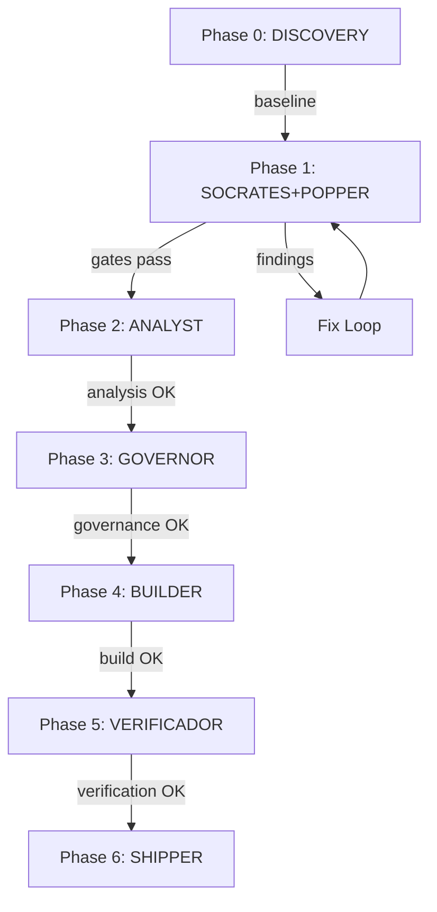

# OMK Extension Suite Orchestrator — OrthoPlus Enterprise

## Context
- **Feature**: 020-spec-memory-hub
- **Branch**: main
- **CLI Version**: specify v0.8.14.dev0
- **Extensions Installed**: 34 → target: 103 (all catalog)
- **Quality Gates**: PASS (build 0 errors, lint 0 errors, tests 625/625)

## Orchestration Architecture

### Squad Assignment
| Squad | Role | Extensions | Priority |
|-------|------|------------|----------|
| DISCOVERY | Bootstrap & baseline | doctor, brownfield, repoindex | P0 |
| SOCRATES | Spec hardening | red-team, critique, security-review-plan | P0 |
| POPPER | Architecture & design | architecture-guard, blueprint, scope | P0 |
| ANALYST | Impact & estimation | ripple, analyze, diagram | P1 |
| GOVERNOR | Governance & memory | agent-governance, memorylint, version-guard | P1 |
| BUILDER | Implementation support | fleet, schedule, orchestrator | P2 |
| VERIFICADOR | Post-impl verification | verify, verify-tasks, cleanup | P0 |
| SHIPPER | Release & archive | ship, archive, retro | P2 |

### Execution Pipeline


### Commands per Phase

#### Phase 0 — Discovery
```bash
# Health check
/speckit.doctor-check

# Architecture discovery
/speckit.brownfield-scan
/speckit.brownfield-validate

# Repository indexing
/speckit.repoindex-overview
/speckit.repoindex-architecture
/speckit.repoindex-module
```

#### Phase 1 — Spec Quality Gates
```bash
# Red team adversarial review
/speckit.red-team-run

# Critique dual-lens review
/speckit.critique-run

# Security review
/speckit.security-review-plan
/speckit.security-review-tasks

# Architecture guard
/speckit.architecture-guard-architecture-review
```

#### Phase 2 — Analysis
```bash
# Scope & estimation
/speckit.scope-estimate
/speckit.scope-budget

# Ripple side-effect detection
/speckit.ripple-scan

# Cross-artifact analysis
/speckit.analyze

# Diagrams
/speckit.diagram-workflow
/speckit.diagram-dependencies
/speckit.diagram-status
```

#### Phase 3 — Governance
```bash
# Agent governance
/speckit.agent-governance-refresh

# Memory lint
/speckit.memorylint-run

# Version guard
/speckit.version-guard-check
/speckit.version-guard-validate

# Catalog validation
/speckit.catalog-ci
```

#### Phase 4 — Implementation Support
```bash
# Blueprint
/speckit.blueprint-generate
/speckit.blueprint-validate

# Multi-model review
/speckit.multi-model-review

# Fleet orchestration
/speckit.fleet
```

#### Phase 5 — Verification
```bash
# Post-implementation verification
/speckit.verify-run

# Task phantom check
/speckit.verify-tasks-run

# Cleanup
/speckit.cleanup-run

# Ripple resolution
/speckit.ripple-resolve

# Staff review
/speckit.staff-review-run
```

#### Phase 6 — Release
```bash
# Ship
/speckit.ship-run

# Archive
/speckit.archive-run

# Retrospective
/speckit.retro-run
/speckit.retrospective-analyze
```

## Result Aggregation
All outputs aggregated into:
- `.specify/memory/extension-suite-report.md`
- `.specify/memory/extension-suite-findings.md`
- `.specify/memory/extension-suite-metrics.json`
