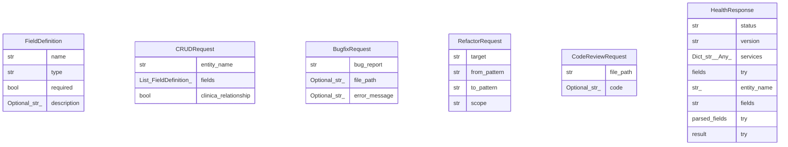

# Data Model

<!-- docguard:version 0.1.0 -->
<!-- docguard:status draft -->
<!-- docguard:last-reviewed 2026-05-26 -->
<!-- docguard:generated true -->

> **Auto-generated by DocGuard.** Review and refine this document.

| Metadata | Value |
|----------|-------|
| **Status** |  |
| **Version** | `0.1.0` |
| **Database** | TBD |
| **ORM** | None detected |
| **Schema Source** | pydantic |
| **Entities** | 6 |
| **Relationships** | 0 |

---

## Entity Summary

| Entity | Storage | Primary Key | Source | Fields |
|--------|---------|-------------|--------|--------|
| FieldDefinition | TBD | fielddefinitionId | /home/b0yz4kr14/Projects/OrthoPlus-Enterprise/agent-service/src/main.py | 4 fields |
| CRUDRequest | TBD | crudrequestId | /home/b0yz4kr14/Projects/OrthoPlus-Enterprise/agent-service/src/main.py | 3 fields |
| BugfixRequest | TBD | bugfixrequestId | /home/b0yz4kr14/Projects/OrthoPlus-Enterprise/agent-service/src/main.py | 3 fields |
| RefactorRequest | TBD | refactorrequestId | /home/b0yz4kr14/Projects/OrthoPlus-Enterprise/agent-service/src/main.py | 4 fields |
| CodeReviewRequest | TBD | codereviewrequestId | /home/b0yz4kr14/Projects/OrthoPlus-Enterprise/agent-service/src/main.py | 2 fields |
| HealthResponse | TBD | healthresponseId | /home/b0yz4kr14/Projects/OrthoPlus-Enterprise/agent-service/src/main.py | 10 fields |

---

## Entity Details

### FieldDefinition

> Source: `/home/b0yz4kr14/Projects/OrthoPlus-Enterprise/agent-service/src/main.py` (pydantic)

| Field | Type | Required | Default | Constraints | Description |
|-------|------|:--------:|---------|-------------|-------------|
| name | str | ✓ | — |  |  |
| type | str | ✓ | — |  |  |
| required | bool | ✓ | — |  |  |
| description | Optional[str] | ✗ | — |  |  |

### CRUDRequest

> Source: `/home/b0yz4kr14/Projects/OrthoPlus-Enterprise/agent-service/src/main.py` (pydantic)

| Field | Type | Required | Default | Constraints | Description |
|-------|------|:--------:|---------|-------------|-------------|
| entity_name | str | ✓ | — |  |  |
| fields | List[FieldDefinition] | ✓ | — |  |  |
| clinica_relationship | bool | ✓ | — |  |  |

### BugfixRequest

> Source: `/home/b0yz4kr14/Projects/OrthoPlus-Enterprise/agent-service/src/main.py` (pydantic)

| Field | Type | Required | Default | Constraints | Description |
|-------|------|:--------:|---------|-------------|-------------|
| bug_report | str | ✓ | — |  |  |
| file_path | Optional[str] | ✗ | — |  |  |
| error_message | Optional[str] | ✗ | — |  |  |

### RefactorRequest

> Source: `/home/b0yz4kr14/Projects/OrthoPlus-Enterprise/agent-service/src/main.py` (pydantic)

| Field | Type | Required | Default | Constraints | Description |
|-------|------|:--------:|---------|-------------|-------------|
| target | str | ✓ | — |  |  |
| from_pattern | str | ✓ | — |  |  |
| to_pattern | str | ✓ | — |  |  |
| scope | str | ✓ | — |  |  |

### CodeReviewRequest

> Source: `/home/b0yz4kr14/Projects/OrthoPlus-Enterprise/agent-service/src/main.py` (pydantic)

| Field | Type | Required | Default | Constraints | Description |
|-------|------|:--------:|---------|-------------|-------------|
| file_path | str | ✓ | — |  |  |
| code | Optional[str] | ✗ | — |  |  |

### HealthResponse

> Source: `/home/b0yz4kr14/Projects/OrthoPlus-Enterprise/agent-service/src/main.py` (pydantic)

| Field | Type | Required | Default | Constraints | Description |
|-------|------|:--------:|---------|-------------|-------------|
| status | str | ✓ | — |  |  |
| version | str | ✓ | — |  |  |
| services | Dict[str, Any] | ✓ | — |  |  |
| try | fields | ✓ | — |  |  |
| entity_name | str, | ✓ | — |  |  |
| fields | str | ✓ | — |  |  |
| try | parsed_fields | ✓ | — |  |  |
| try | result | ✓ | — |  |  |
| try | result | ✓ | — |  |  |
| try | result | ✓ | — |  |  |

## Relationships

| From | To | Type | FK/Reference | Cascade |
|------|-----|------|-------------|---------|
| <!-- No relationships detected --> | | | | |

## Entity-Relationship Diagram

## Indexes

| Table | Index Name | Fields | Type | Purpose |
|-------|-----------|--------|------|---------|
| <!-- TBD: Document indexes --> | | | | |

---

## Revision History

| Version | Date | Author | Changes |
|---------|------|--------|---------|
| 0.1.0 | 2026-05-26 | DocGuard Generate | Auto-generated (6 entities, 0 relationships from pydantic) |

---

## Standards Reference

> **Aligned with**: C4 Component Diagram + Entity-Relationship (Chen notation)
>
> **Sections covered**: Entities, Relationships, ER Diagrams (Mermaid), Field-level definitions
>
> **Reference**: Brown, S. "C4 Model — Component diagrams." https://c4model.com | Chen, P. "The Entity-Relationship Model." ACM TODS 1(1), 1976
>
> *Standards alignment inspired by RAG-grounded generation (Lopez et al., AITPG, IEEE TSE 2026).*
