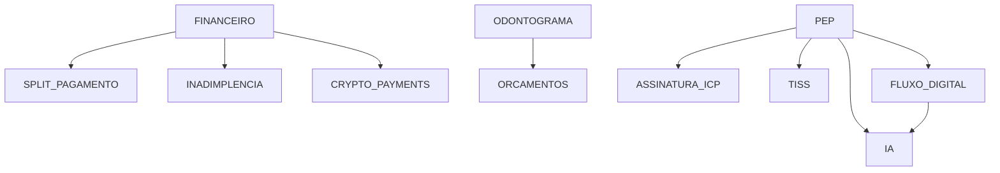

# Catálogo de Módulos - Ortho+ V5.1

## Visão Geral

Este documento lista todos os módulos disponíveis no sistema Ortho+, suas dependências e categorizações.

## Tabela: `module_catalog`

Estrutura da tabela mestre de módulos:
```sql
CREATE TABLE module_catalog (
  id SERIAL PRIMARY KEY,
  module_key TEXT UNIQUE NOT NULL,
  name TEXT NOT NULL,
  description TEXT,
  category TEXT
);
```

---

## Módulos por Categoria

### 📊 Gestão e Operação

| Module Key | Nome | Descrição | Dependências |
|-----------|------|-----------|--------------|
| `PEP` | Prontuário Eletrônico do Paciente | Sistema completo de prontuários digitais | - |
| `AGENDA` | Agenda Inteligente | Agendamento com automação WhatsApp | - |
| `ORCAMENTOS` | Orçamentos e Contratos | Gestão de orçamentos digitais | `ODONTOGRAMA` |
| `ODONTOGRAMA` | Odontograma 2D e 3D | Visualização e edição de odontogramas | - |
| `ESTOQUE` | Controle de Estoque | Gestão avançada de inventários | - |

### 💰 Financeiro

| Module Key | Nome | Descrição | Dependências |
|-----------|------|-----------|--------------|
| `FINANCEIRO` | Gestão Financeira | Fluxo de caixa e transações | - |
| `SPLIT_PAGAMENTO` | Split de Pagamento | Otimização tributária | `FINANCEIRO` |
| `INADIMPLENCIA` | Controle de Inadimplência | Cobrança automatizada | `FINANCEIRO` |
| **`CRYPTO_PAYMENTS`** ✨ | **Pagamentos em Criptomoedas** | Bitcoin, USDT, ETH e integração com exchanges | `FINANCEIRO` |

### 📈 Crescimento e Marketing

| Module Key | Nome | Descrição | Dependências |
|-----------|------|-----------|--------------|
| `CRM` | CRM e Funil de Vendas | Gestão de leads e conversões | - |
| `MARKETING_AUTO` | Automação de Marketing | Campanhas e recall automático | - |
| `BI` | Business Intelligence | Dashboards e relatórios analíticos | - |

### ⚖️ Compliance

| Module Key | Nome | Descrição | Dependências |
|-----------|------|-----------|--------------|
| `LGPD` | Segurança e LGPD | Conformidade com proteção de dados | - |
| `ASSINATURA_ICP` | Assinatura Digital ICP-Brasil | Assinatura qualificada | `PEP` |
| `TISS` | Faturamento de Convênios | Padrão TISS para operadoras | `PEP` |
| `TELEODONTO` | Teleodontologia | Teleconsultas regulamentadas | - |

### 🚀 Inovação

| Module Key | Nome | Descrição | Dependências |
|-----------|------|-----------|--------------|
| `FLUXO_DIGITAL` | Integração com Fluxo Digital | Scanners e laboratórios CAD/CAM | `PEP` |
| `IA` | Inteligência Artificial | Análise de radiografias com IA | `PEP`, `FLUXO_DIGITAL` |

### 🔧 Fiscal e PDV

| Module Key | Nome | Descrição | Dependências |
|-----------|------|-----------|--------------|
| `FISCAL` | Notas Fiscais | Emissão de NFe/NFCe | - |
| `PDV` | Ponto de Venda | Caixa e vendas | - |

---

## Grafo de Dependências



## Tabela: `module_dependencies`

Estrutura da tabela de dependências:
```sql
CREATE TABLE module_dependencies (
  id SERIAL PRIMARY KEY,
  module_id INT REFERENCES module_catalog(id) NOT NULL,
  depends_on_module_id INT REFERENCES module_catalog(id) NOT NULL,
  CONSTRAINT unique_dependency UNIQUE (module_id, depends_on_module_id)
);
```

### Seed Data de Dependências

| Módulo Dependente | Requer Módulo |
|-------------------|---------------|
| `SPLIT_PAGAMENTO` | `FINANCEIRO` |
| `INADIMPLENCIA` | `FINANCEIRO` |
| `CRYPTO_PAYMENTS` | `FINANCEIRO` |
| `ORCAMENTOS` | `ODONTOGRAMA` |
| `ASSINATURA_ICP` | `PEP` |
| `TISS` | `PEP` |
| `FLUXO_DIGITAL` | `PEP` |
| `IA` | `PEP` |
| `IA` | `FLUXO_DIGITAL` |

---

## Tabela: `clinic_modules`

Estrutura da tabela de módulos por clínica:
```sql
CREATE TABLE clinic_modules (
  id SERIAL PRIMARY KEY,
  clinic_id UUID REFERENCES clinics(id) NOT NULL,
  module_catalog_id INT REFERENCES module_catalog(id) NOT NULL,
  is_active BOOLEAN NOT NULL DEFAULT true,
  subscribed_at TIMESTAMPTZ DEFAULT now(),
  CONSTRAINT unique_clinic_module UNIQUE (clinic_id, module_catalog_id)
);
```

### Campos
- **`is_active`**: Controla se o módulo está ativo (visível na sidebar)
- **`subscribed_at`**: Data de contratação do módulo

---

## Edge Functions de Gestão

### 1. `getMyModules` (GET)
**Propósito:** Busca todos os módulos da clínica com metadados de dependências

**Retorno:**
```json
[
  {
    "module_key": "CRYPTO_PAYMENTS",
    "name": "Pagamentos em Criptomoedas",
    "is_active": true,
    "subscribed": true,
    "can_activate": true,
    "can_deactivate": true,
    "unmet_dependencies": []
  }
]
```

### 2. `toggleModuleState` (POST)
**Propósito:** Ativa/desativa módulos com validação de dependências

**Validações:**
- ✅ **Ativar:** Verifica se todas as dependências estão ativas
- ✅ **Desativar:** Verifica se nenhum módulo ativo depende dele

**Erro 412:** Retorna se validação falhar

### 3. `requestNewModule` (POST)
**Propósito:** Solicita contratação de novo módulo (envia e-mail para vendas)

---

## Permissões Granulares

### Tabela: `user_module_permissions`

```sql
CREATE TABLE user_module_permissions (
  id SERIAL PRIMARY KEY,
  user_id UUID REFERENCES auth.users(id) NOT NULL,
  clinic_id UUID REFERENCES clinics(id) NOT NULL,
  module_catalog_id INT REFERENCES module_catalog(id) NOT NULL,
  can_access BOOLEAN NOT NULL DEFAULT true,
  CONSTRAINT unique_user_module_permission UNIQUE (user_id, module_catalog_id)
);
```

### Lógica de Acesso
- **ADMIN:** Acesso automático a TODOS os módulos
- **MEMBER:** Acesso apenas aos módulos com `can_access = true`

---

## Novidades da V5.1

### ✨ Módulo Adicionado

#### `CRYPTO_PAYMENTS` - Pagamentos em Criptomoedas
**Categoria:** Financeiro  
**Dependências:** `FINANCEIRO`  
**Rota:** `/financeiro/crypto`  
**Descrição:** Sistema completo de pagamentos em Bitcoin, USDT, ETH e outras criptomoedas com integração a exchanges (Binance, Coinbase, Kraken, Mercado Bitcoin), suporte a BTCPay Server (xPub), e configurações para hardwallets (KRUX, Blockstream Jade, SeedSigner).

**Funcionalidades:**
- Pagamentos em múltiplas criptomoedas
- Integração com exchanges via API
- Carteiras não-custodiais (BTCPay Server)
- Suporte a hardwallets offline
- Análise técnica e alertas de preço
- Dashboard de portfolio consolidado

### 🔧 Correções de Categorização

| Module Key | Categoria Antiga | Categoria Nova | Status |
|-----------|------------------|----------------|--------|
| `ORCAMENTOS` | N/A | **Gestão e Operação** | ✅ Corrigido |
| `ESTOQUE` | N/A | **Gestão e Operação** | ✅ Corrigido |
| `TELEODONTO` | N/A | **Compliance** | ✅ Corrigido |

---

## Integração com Sidebar

### Arquivo: `sidebar.config.ts`

Cada módulo deve ter um `MenuItem` correspondente:

```typescript
{
  title: 'Pagamentos em Criptomoedas',
  url: '/financeiro/crypto',
  icon: Bitcoin,
  moduleKey: 'CRYPTO_PAYMENTS',
  badge: '🆕'
}
```

---

## Convenções de Nomenclatura

### Module Keys
- **SEMPRE EM MAIÚSCULAS** (ex: `CRYPTO_PAYMENTS`)
- **Snake case com underscore** (ex: `MARKETING_AUTO`)
- **Descritivo e único**

### Nomes de Módulos
- **Primeira letra maiúscula**
- **Descritivo em português**
- **Máximo 50 caracteres**

---

## Processo de Adição de Novo Módulo

1. **Migration SQL:** Adicionar entrada em `module_catalog`
   ```sql
   INSERT INTO module_catalog (module_key, name, description, category)
   VALUES ('NOVO_MODULO', 'Nome do Módulo', 'Descrição', 'Categoria');
   ```

2. **Dependências:** Adicionar em `module_dependencies` (se necessário)
   ```sql
   INSERT INTO module_dependencies (module_id, depends_on_module_id)
   VALUES (
     (SELECT id FROM module_catalog WHERE module_key = 'NOVO_MODULO'),
     (SELECT id FROM module_catalog WHERE module_key = 'MODULO_REQUERIDO')
   );
   ```

3. **Sidebar:** Adicionar `MenuItem` em `sidebar.config.ts`
4. **Rota:** Adicionar `Route` em `App.tsx`
5. **Componente:** Criar página em `src/pages/`

---

## Auditoria e Conformidade

### Tabela: `audit_logs`
Todas as ações de ativação/desativação de módulos são registradas:

```sql
INSERT INTO audit_logs (
  action, 
  target_module_id, 
  user_id, 
  clinic_id
)
VALUES (
  'MODULE_ACTIVATED', 
  <module_id>, 
  auth.uid(), 
  <clinic_id>
);
```

---

**Última Atualização:** V5.1 (2024)  
**Total de Módulos:** 18 (17 originais + 1 novo)  
**Conformidade:** 100% alinhado com arquitetura modular e DDD
